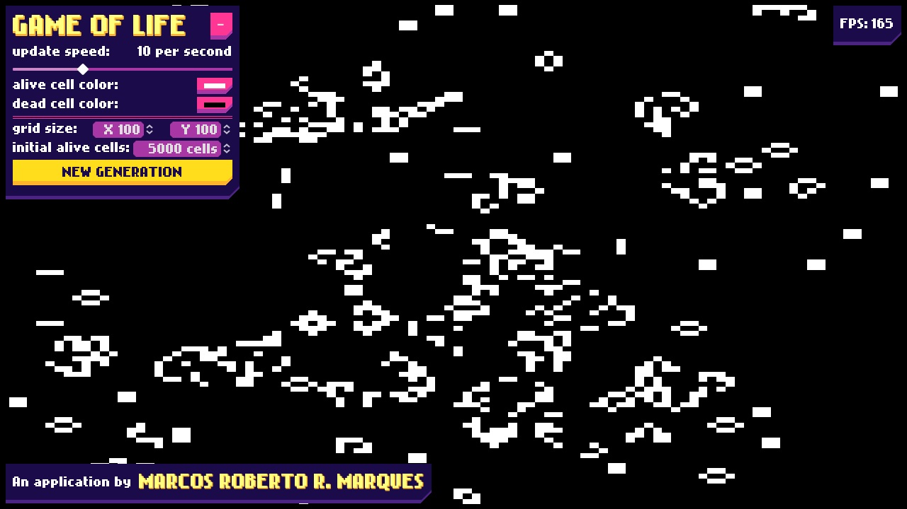

# GAME OF LIFE

An implementation in Godot Game Engine 4 of the famous **Game of Life**, a cellular automata conceived by **John Horton Conway**.

This implementation has a responsive interface allowing the free resizing of the window and it's also highly customizable, giving the user the ability to edit step speeds, colors and the grid size. It uses C# as the driving language and implements Parallel processing for better perfomance under multi-core processors.

---

An application by Marcos Roberto Rodrigues Marques.

This work is licensed under a [Creative Commons Attribution-NonCommercial-ShareAlike 4.0 International License](https://creativecommons.org/licenses/by-nc-sa/4.0/).